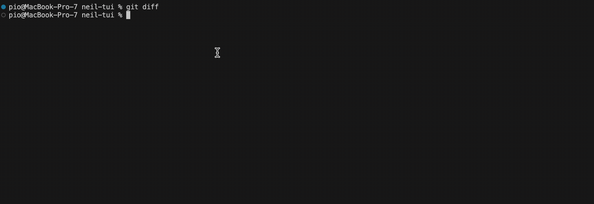

# neil-tui

Minimal TUI wrapper around [babashka/neil](https://github.com/babashka/neil)'s `dep search` and `dep add` commands:



It queries for deps via `neil dep search` and allows you to use up/down arrows to select a dependency.

Then, if there is more than one `deps.edn` file in the file tree of the current directory, it asks you which file to add the dependency to.


## Installation

Prerequisite: [babashka/bbin](https://github.com/babashka/bbin)
````
bbin install io.github.roterski/neil-tui
````
